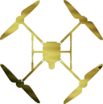

# Autonomous Micro-Aerial Vehicles

AuMAV is an entry-point into a set of techniques and packages used and/or
implemented by the drone lab at CAS/RPL.

In its most basic form it is a ROS launch file with which a drone can be made
to run autonomously in different configurations.

Planned features:

- Support for multiple localization and mapping solutions
  - HectorSLAM for LiDAR-based SLAM
  - ORB-SLAM2 for visual SLAM
- Collision avoidance pass-through controller
- Extensible Python state machine for high-level planning
  - Recovery from tracking errors
  - Autonomous exploration capabilites

## Planning

Please refer to `COROUTINES.md` for an explanation of how planning is handled.
